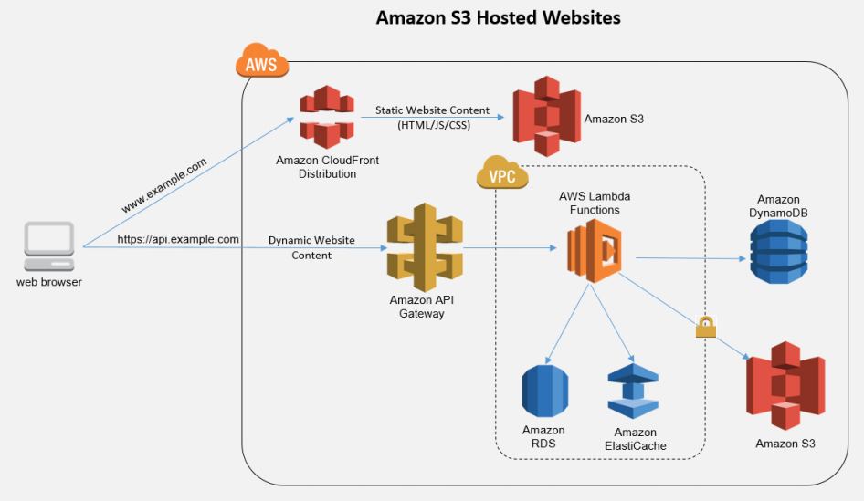
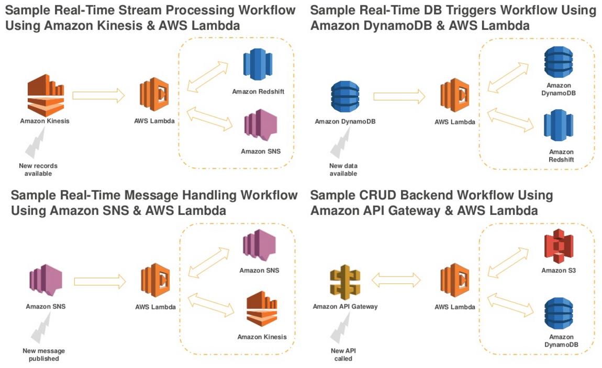
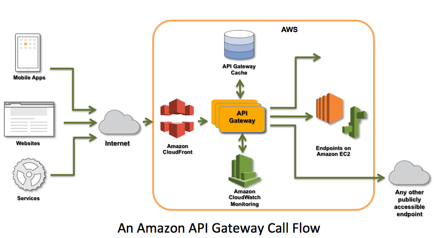
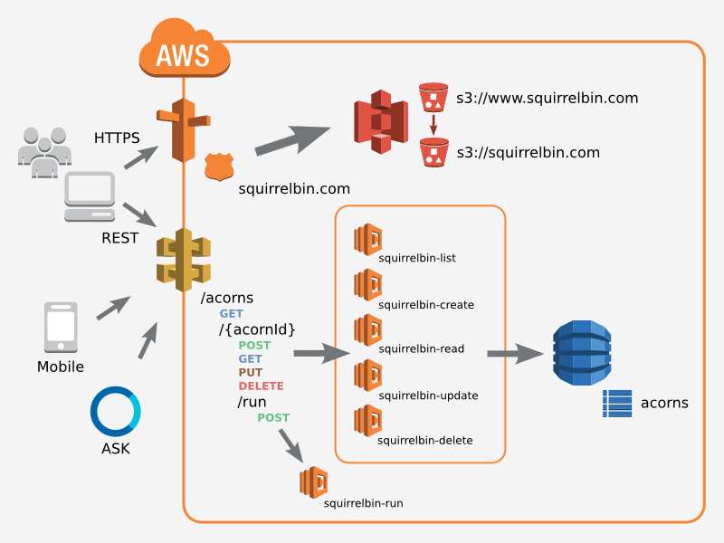

#  AWS Lambda

---

##[AWS Lambda](https://aws.amazon.com/lambda/)

Run code without thinking about servers.  
Pay for only the compute time you consume.

--

[AWS Serverless Multi-Tier Architecture](https://d0.awsstatic.com/whitepapers/AWS_Serverless_Multi-Tier_Archiectures.pdf)

--

## Configuration

- Name and description
- Execution environment ([Node.js 0.10, Java 8, Python 2](http://docs.aws.amazon.com/lambda/latest/dg/current-supported-versions.html))
- Source code and entry point (*handler*)
- IAM execution role
- Memory (128-1536 MB) and time (1-300 sec) allocated

--

## Hello Lambda!

<pre><code data-trim class="javascript">
exports.handler = function(event, context) {
  console.log('Hello CloudWatch logs!');

  var response = {
    'lambdaInputEvent': event,
    'lambdaExecutionContext': context,
    'lambdaRemainingMillis': context.getRemainingTimeInMillis()
  };
  
  context.succeed(response);
  // context.fail('Something went wrong');
  // context.done (Error error, Object result);
};
</code></pre>

--

## Invocation

- Synchronous **[Request-Response](http://docs.aws.amazon.com/lambda/latest/dg/intro-core-components.html)** from API Gateway or manually from AWS console
- Asynchronous **[Event](http://docs.aws.amazon.com/lambda/latest/dg/intro-core-components.html)** from other AWS services (S3, SNS, DynamoDB, Kinesis, Cognito Sync Trigger, AWS IoT, CloudWatch logs, Scheduled event). Lambda does not send response to events.
- For some event sources, Lambda must poll it ([pull](http://docs.aws.amazon.com/lambda/latest/dg/intro-invocation-modes.html) model). Some event sources directly invoke the Lambda function ([push](http://docs.aws.amazon.com/lambda/latest/dg/intro-invocation-modes.html) model).

--

--

## [Pricing](https://aws.amazon.com/lambda/pricing/)

- $0.20 per million requests (first million free per month)
- $0.00001667 per GB-second based on execution time and memory allocated (400,000 GB-seconds free per month)
- Example: 128 MB, 30 million executions, 200 ms duration = $11.63 per month

---

# API Gateway

--

--

## API Gateway integration

- Lambda function: Call a Lambda function
- HTTP Proxy: Call a remote HTTP server
- AWS Service proxy: Directly call another AWS service
- Mock integration: Return a mock response

--

## Data modeling

- [Models and Mapping Templates](http://docs.aws.amazon.com/apigateway/latest/developerguide/models-mappings.html)
- Schemas use [JSON Schema](http://json-schema.org/)
- Mapping templates use [Velocity Template Language](https://velocity.apache.org/engine/releases/velocity-1.7/user-guide.html) and [JSONPath](http://goessner.net/articles/JsonPath/)

--

## API [pricing](https://aws.amazon.com/api-gateway/pricing/)

- $3.50 per million API calls received (Free Tier available)
- $0.09/GB for the first 10 TB data transfer out
- Optional caching: 0.5 GB $0.020 per hour, 6.1 GB $0.200 per hour
- Example: 5 million calls, 3 kB responses, no caching = $18.79 per month

---

# DynamoDB

- [Stream](http://docs.aws.amazon.com/amazondynamodb/latest/developerguide/Streams.html) changes to Lambda

---

# Architectures

--

[SquirrelBin: A Serverless Microservice Using AWS Lambda](https://aws.amazon.com/blogs/compute/the-squirrelbin-architecture-a-serverless-microservice-using-aws-lambda/)

--

[AWS Serverless Multi-Tier Architectures whitepaper](https://d0.awsstatic.com/whitepapers/AWS_Serverless_Multi-Tier_Archiectures.pdf)

---

## Things to consider

- Local development and testing?
- Consider several URL paths and their HTTP Verbs. How many Lambda functions?
- How much things should be done in API Gateway (schemas validation)?
- Is the API cache worth it?
- Node.js frameworks [serverless](https://github.com/serverless/serverless) and [fluct](https://github.com/fluct/fluct)

--

## Under development

- AWS CLI tools lack support for API Gateway
- CloudFormation lacks support for API Gateway
- boto and Ansible lack support for Lambda and API Gateway
- Ansible and AWS CLI tools should have an easy way to both upload and update Lambda sources
- Streams: cannot create a stream and cannot link a lambda to a stream in CloudFormation

--

## References

- [Lambda](http://docs.aws.amazon.com/lambda/latest/dg/welcome.html) and [API Gateway](http://docs.aws.amazon.com/apigateway/latest/developerguide/welcome.html) developer guides
- Node.js frameworks [serverless](https://github.com/serverless/serverless) and [fluct](https://github.com/fluct/fluct)
- [Build and Manage Your APIs](http://www.slideshare.net/AmazonWebServices/build-and-manage-your-apis-with-amazon-api-gateway)
- [SquirrelBin: A Serverless Microservice](https://aws.amazon.com/blogs/compute/the-squirrelbin-architecture-a-serverless-microservice-using-aws-lambda/)
- [Create a serverless RESTful API](https://cloudonaut.io/create-a-serverless-restful-api-with-api-gateway-swagger-lambda-and-dynamodb/)
